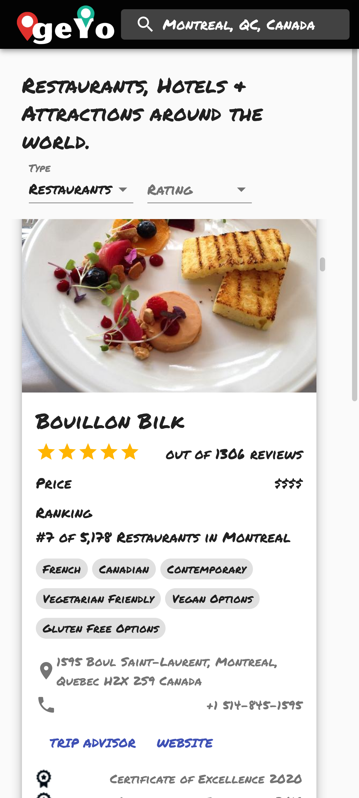

# geYo
Maps application that lets the user search for restaurants, hotels, attractions around the world. 

<a class="README-link" href="https://geyo.netlify.app">Live Demo</a>

<h3>Technologies:</h3>
 <ul>
    <li>REACT</li>
    <li>Material-UI</li>
    <li>Netlify</li>
 </ul>

## Preview:

 <h3>APIs:</h3>
 <ul>
    <li>Google maps</li>
    <li>Rapid API</li>
    <li>OpenWeatherMap</li>
 </ul>

<h3>Dependencies:</h3>
<ul>
  <li>@material-ui/core</li>
  <li>@material-ui/icons</li>
  <li>@material-ui/lab</li>
  <li>@react-google-maps/api</li>
  <li>axios google-map-react</li>
</ul>

<h3>Learned:</h3>
<ul>
  <li>React best practices folder/file structure.</li>
  <li>Hooks (let's you use state and other React features without writing a class.)</li>
  <li>refs (Refs provide a way to access DOM nodes or 
  React elements created in the render method).</li>
  <li>Improve security with environment variables.</li>
  <li>GeoLocation.</li>
  <li>Google Cloud Platform.</li>
  <li>Axios library which is used to make requests to an API, 
  return data from the API, and then do things with that data in our React application.</li>
  <li>Data filtering.</li>
  <li>Snazzy Maps styling</li>
</ul>

